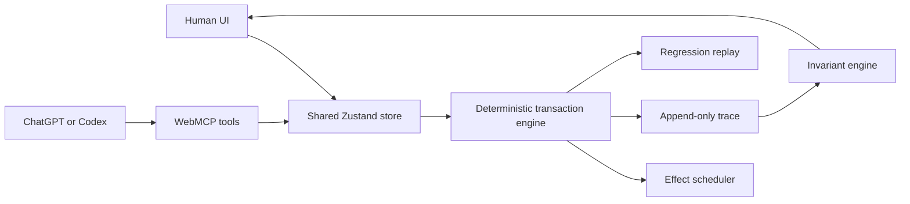

# StateTrace

[](https://github.com/Iltwats/stateTrace/actions/workflows/ci.yml)
[](LICENSE)
[](.nvmrc)

**See what an agent changed, follow every update, and restore the form when something goes wrong.**

StateTrace is an open-source reference implementation for observable WebMCP workflows. It records human and agent edits in one activity timeline, identifies who changed each value, creates automatic checkpoints, and lets the user return the form to an earlier state.

The included checkout shows the complete experience: a person can fill in delivery and payment details while an agent updates the same order through structured website tools. Pending, failed, duplicate, stale, and successfully committed operations remain visible instead of being hidden behind the final field values. Checkout data stays in the browser tab, and the demo does not process a real payment.

**Try it:** https://state-trace.vercel.app/ — use a WebMCP-capable browser for agent interaction, or explore the complete human workflow in manual mode.

## Why WebMCP

An interface can appear updated before its underlying operation commits. Screenshots and generic DOM actions cannot reliably tell an agent whether a write is pending, failed, duplicated, superseded, or based on a stale revision.

StateTrace exposes those application semantics directly through six bounded site tools. The human edits and locks fields in the visible UI; the agent reads the same canonical state, recovers incomplete work, and verifies the outcome through WebMCP.

## Try the checkout

1. Open the [live site](https://state-trace.vercel.app/) and select **Open checkout demo**.
2. Select the WebMCP status badge. It shows the connection state and setup steps for a compatible browser.
3. Ask the agent to update the shipping address, or use **Preview agent update** to simulate the same operation manually.
4. Watch the field move through its pending state, then open **Activity** to see the actor, previous value, new value, and result.
5. Change another field yourself or apply a coupon. Human and agent edits appear separately in the same history.
6. Open a restore point in **Activity** and restore it. The form returns to that checkpoint without erasing the later history.

Suggested agent request:

> Read the current order state. Update the shipping address to 44 River Road, Portland, OR 97209, wait for it to commit, and verify the final address and revision.

## WebMCP tools

| Tool                       | Type  | Purpose                                                                                                           |
| -------------------------- | ----- | ----------------------------------------------------------------------------------------------------------------- |
| `get_transaction_state`    | Read  | Read revision, committed values, optimistic differences, locks, pending/failed effects, and verification summary. |
| `list_transaction_events`  | Read  | Inspect a bounded ordered part of the append-only transaction trace.                                              |
| `verify_transaction_state` | Read  | Run deterministic invariants and optional exact postconditions.                                                   |
| `stage_order_change`       | Write | Stage one validated optimistic order-field mutation at an observed revision.                                      |
| `retry_failed_transaction` | Write | Retry one failed/superseded transaction while preserving newer human state.                                       |
| `save_regression_fixture`  | Write | Capture the current trace as a local deterministic regression fixture.                                            |

Every schema rejects unknown properties. Executable code revalidates fields, revisions, locks, statuses, ranges, and idempotency. Registration and execution support cancellation through `AbortSignal`.

## Architecture



The React UI and WebMCP tools never maintain separate application state. Both call the same transaction engine.

## Transaction guarantees

- Committed and optimistic state are separate.
- Every committed application mutation advances the revision.
- Writes must include the revision observed by the caller.
- Field-level conflict detection permits safe independent changes but rejects stale same-field writes.
- Human locks are enforced again at commit time.
- Idempotency keys prevent duplicate logical commits.
- Failed effects never mutate committed state.
- Every human or agent field change is recorded and actor-attributed.
- Verification and replay are deterministic code, not LLM judgment.

## Local development

Requirements: Node.js 20 or later and npm.

```bash
npm install
npm run dev
```

Open `http://localhost:5173`.

### Tests

```bash
npm run format:check
npm run typecheck
npm test
npm run build
```

The suite covers engine behavior, failure scheduling, invariant checks, shared-store integration, UI interaction, replay, and WebMCP contracts.

### Scripts

| Script                 | Purpose                                                    |
| ---------------------- | ---------------------------------------------------------- |
| `npm run dev`          | Dev server with hot reload at `http://localhost:5173`.     |
| `npm run build`        | Type check, then build the production bundle into `dist/`. |
| `npm run preview`      | Serve the built bundle at `http://localhost:4173`.         |
| `npm run format`       | Format the repository with Prettier.                       |
| `npm run format:check` | Check formatting without changing files.                   |
| `npm run typecheck`    | Type check only.                                           |
| `npm test`             | Run the Vitest suite once.                                 |
| `npm run test:watch`   | Run the suite in watch mode.                               |
| `npm run coverage`     | Run the suite with coverage.                               |

## Testing WebMCP

1. Open StateTrace in a browser or agent host that supports `document.modelContext`.
2. Select the WebMCP status badge to inspect the live connection state.
3. If WebMCP is unavailable, follow the steps in the setup dialog, restart the browser when requested, and reload StateTrace.
4. Confirm that the badge reads **WebMCP connected · 6 tools**.
5. Ask the agent to read the order before changing one supported field, then verify the committed result.

When `document.modelContext` is unavailable, StateTrace deliberately uses manual mode. The checkout, activity history, automatic checkpoints, and restoration flow remain usable without an agent.

## Deploy

StateTrace is deployed on Vercel at https://state-trace.vercel.app/. It is a static client app with no application server, database, API key, or required environment variables. Any static host can build it with:

```bash
npm ci
npm run build
# serve dist/
```

## Evaluation

The prompt suite is in [`evals/statetrace.json`](evals/statetrace.json). It tests:

- Correct first-tool selection
- Read-only requests that must not invoke write tools
- Valid arguments and revisions
- Locked and stale-field rejection
- Failure recovery without overwriting human state
- Postcondition verification
- Regression fixture capture

Current automated checks target:

- 100% stale same-field write rejection
- 100% locked-field write rejection
- 100% duplicate effects applied at most once
- 100% agent writes visible and attributed
- Deterministic replay with passing hard invariants

## Project structure

```text
src/
  components/     Human-facing workspace and evidence panels
  domain/         Order, transaction, event, and fixture types
  engine/         Transaction, scheduling, invariant, and replay logic
  fixtures/       Deterministic baseline state
  store/          Shared UI/WebMCP application state
  webmcp/         Tool schemas, serializers, registration, and lifecycle
```

## Scope and safety

StateTrace is a synthetic reliability and debugging environment. It does not connect to a real commerce system, execute payments/refunds, or claim to prevent arbitrary prompt injection. User-generated notes and trace content are marked untrusted where returned through WebMCP.

## Contributing

Contributions are welcome. Start with [`CONTRIBUTING.md`](CONTRIBUTING.md) — the one rule everything else follows from is that the human UI and the WebMCP tools never hold separate application state.

Participation is governed by the [`Code of Conduct`](CODE_OF_CONDUCT.md). For security reports, use [`SECURITY.md`](SECURITY.md) rather than a public issue.

## License

Apache License 2.0 — see [`LICENSE`](LICENSE) and [`NOTICE`](NOTICE).
