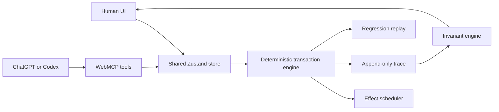

# StateTrace

StateTrace is a WebMCP-native transaction debugger for human-agent workflows in modern web applications. It makes optimistic UI, committed state, pending effects, conflicts, retries, locks, and deterministic postconditions visible in one shared workspace.

The hackathon demo uses a synthetic order-management SPA. No account, backend, model API, or external data is required.

## Why WebMCP

An interface can appear updated before its underlying operation commits. Screenshots and generic DOM actions cannot reliably tell an agent whether a write is pending, failed, duplicated, superseded, or based on a stale revision.

StateTrace exposes those application semantics directly through six bounded site tools. The human edits and locks fields in the visible UI; the agent reads the same canonical state, recovers incomplete work, and verifies the outcome through WebMCP.

## Primary demo

1. Select **Fail next**.
2. Stage the agent address change.
3. While the address is optimistic, change shipping to **Local pickup** and lock it.
4. The injected address write fails and rolls back visibly.
5. Retry only the failed address transaction.
6. The address commits, the human shipping choice remains locked, and all postconditions stay green.
7. Save the trace as a regression fixture and replay it.

In a WebMCP-capable browser, the same flow can be requested conversationally:

> Correct the shipping address to 44 River Road, Portland, OR 97209. If the write fails, preserve my shipping choice, recover only the failed operation, verify the final state, and save the trace as a regression fixture.

## WebMCP tools

| Tool | Type | Purpose |
|---|---|---|
| `get_transaction_state` | Read | Read revision, committed values, optimistic differences, locks, pending/failed effects, and verification summary. |
| `list_transaction_events` | Read | Inspect a bounded ordered part of the append-only transaction trace. |
| `verify_transaction_state` | Read | Run deterministic invariants and optional exact postconditions. |
| `stage_order_change` | Write | Stage one validated optimistic order-field mutation at an observed revision. |
| `retry_failed_transaction` | Write | Retry one failed/superseded transaction while preserving newer human state. |
| `save_regression_fixture` | Write | Capture the current trace as a local deterministic regression fixture. |

Every schema rejects unknown properties. Executable code revalidates fields, revisions, locks, statuses, ranges, and idempotency. Registration and execution support cancellation through `AbortSignal`.

## Architecture



The React UI and WebMCP tools never maintain separate application state. Both call the same transaction engine.

## Transaction guarantees

- Committed and optimistic state are separate.
- Every committed application mutation advances the revision.
- Writes must include the revision observed by the caller.
- Field-level conflict detection permits safe independent changes but rejects stale same-field writes.
- Human locks are enforced again at commit time.
- Idempotency keys prevent duplicate logical commits.
- Failed effects never mutate committed state.
- Every state transition is human-visible and actor-attributed.
- Verification and replay are deterministic code, not LLM judgment.

## Local development

Requirements: Node.js 20 or later and npm.

```bash
npm install
npm run dev
```

Open `http://localhost:5173`.

### Tests

```bash
npm test
npm run build
```

The suite covers engine behavior, failure scheduling, invariant checks, shared-store integration, UI interaction, replay, and WebMCP contracts.

## Testing WebMCP

### ChatGPT desktop app

1. Update to the current ChatGPT desktop app.
2. Open the deployed StateTrace URL in its in-app browser.
3. Check that the header reports **6 WebMCP tools available**.
4. Ask ChatGPT or Codex to inspect the order before requesting a mutation.

### Google Chrome

1. Use Chrome 149 or later.
2. Open `chrome://flags/#enable-webmcp-testing`.
3. Enable WebMCP testing and restart Chrome.
4. Open the deployed StateTrace URL.
5. Confirm the header reports **6 WebMCP tools available**.

When `document.modelContext` is unavailable, StateTrace deliberately enters manual mode and the complete human workflow remains functional.

## Evaluation

The prompt suite is in [`evals/statetrace.json`](evals/statetrace.json). It tests:

- Correct first-tool selection
- Read-only requests that must not invoke write tools
- Valid arguments and revisions
- Locked and stale-field rejection
- Failure recovery without overwriting human state
- Postcondition verification
- Regression fixture capture

Current automated checks target:

- 100% stale same-field write rejection
- 100% locked-field write rejection
- 100% duplicate effects applied at most once
- 100% agent writes visible and attributed
- Deterministic replay with passing hard invariants

## Project structure

```text
src/
  components/     Human-facing workspace and evidence panels
  domain/         Order, transaction, event, and fixture types
  engine/         Transaction, scheduling, invariant, and replay logic
  fixtures/       Deterministic baseline state
  store/          Shared UI/WebMCP application state
  webmcp/         Tool schemas, serializers, registration, and lifecycle
```

The full build specification is available in [`STATETRACE_IMPLEMENTATION_PLAN.md`](STATETRACE_IMPLEMENTATION_PLAN.md).

## Scope and safety

StateTrace is a synthetic reliability and debugging environment. It does not connect to a real commerce system, execute payments/refunds, or claim to prevent arbitrary prompt injection. User-generated notes and trace content are marked untrusted where returned through WebMCP.

## License

MIT — see [`LICENSE`](LICENSE).

