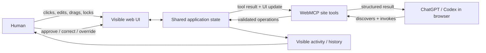
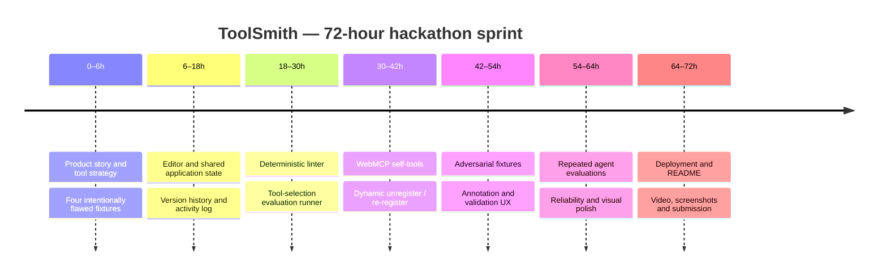

# OpenAI WebMCP Challenge: Hackathon Project Strategy and Build Plans

## Executive summary

The **OpenAI WebMCP Challenge** is asking builders to explore a different model for agentic web applications: instead of an AI agent inferring how to operate a human interface through screenshots, DOM inspection, or simulated clicks, a website exposes **structured, client-side tools** that an agent can discover and invoke while the human continues to use the same live page and session. OpenAI describes the target as an application that becomes “meaningfully better” when a person and their agent work together. citeturn12view0turn12view4

The official rules make the judging strategy unusually clear. After a baseline pass/fail check for theme fit and use of the required technology, qualifying entries are scored on **four equally weighted criteria: WebMCP Leverage, Execution, Potential Impact, and Creativity & Ambition**. This means a technically impressive `registerTool()` demo alone is not enough: the entry needs to feel like a coherent product, solve a recognisable problem, and demonstrate something that genuinely benefits from the human and agent sharing state and control. citeturn13view4

For a **48–72 hour build**, I would optimise for one interaction pattern:

> **The human makes a meaningful change in the visible UI; the agent notices or obtains the resulting structured state through WebMCP, continues the task correctly, changes the application through a narrow WebMCP tool, and the human can immediately see, inspect, or override the result.**

That interaction is closely aligned with WebMCP's stated goals of human-in-the-loop visibility and control, reliable client-side tools instead of brittle UI actuation, and reuse of the application's existing client-side operations. citeturn12view6 It is also a much stronger demonstration of WebMCP than simply exposing a search function.

**My strongest recommendation is `ToolSmith`: a WebMCP-native tool-design and adversarial-testing studio.** The user visually designs or inspects site tools, while an agent uses WebMCP tools to audit those very tool definitions, test schemas, identify overlapping or unsafe operations, modify draft definitions, run synthetic tool-selection evaluations, and dynamically publish improved versions. It is feasible without proprietary model keys, deeply uses WebMCP rather than merely wrapping a conventional app, targets a real emerging developer problem, and is distinct from most of the current WebMCP showcase examples.

My next choices would be:

**`IncidentGlass`** if you want the clearest business/product story and a visually compelling dashboard demo;  
**`A11y StateLab`** if you want a socially useful, technically defensible developer-tool story;  
**`EvalBoard`** if your strengths are AI evaluation/data tooling; and  
**`LayoutLab`** if you want the highest visual “wow” factor.

The deadline in the official rules is **3 September 2026 at 1:00 p.m. Pacific Time**, which is **4 September 2026 at 1:30 a.m. IST**. A live application, public source repository with an open-source licence, project description, and public YouTube demo under three minutes are among the submission requirements. Importantly, the rules explicitly say judges **are not required to run the project** and may evaluate it solely from its description, images, and video. Your demo video is therefore effectively part of the product. citeturn13view0turn13view2turn13view3

My suggested allocation for a 72-hour sprint is therefore approximately **48 hours building, 12–16 hours testing/evaluation, and 8–12 hours polishing deployment, README, screenshots and video**. A spectacular 90-second deterministic workflow is strategically better than a sprawling agentic system that fails unpredictably in front of a judge.

## Challenge brief and winning strategy

### What the challenge actually wants

OpenAI defines WebMCP as an **experimental open standard through which websites expose structured tools directly to agents**. Its rationale is that a website can tell an agent explicitly how to perform useful operations rather than forcing the model to infer those operations from UI elements. The challenge asks entrants to imagine the future of the open web where humans and agents “interact, collaborate, and create together.” citeturn12view0turn13view1

OpenAI's current site-tools documentation makes the architectural distinction especially important: WebMCP tools live with the website and can operate using the **same live page and signed-in session** as the user; they do not require a separate MCP server merely to expose client-side application capabilities. ChatGPT Work and Codex can discover such tools inside the ChatGPT desktop app's built-in browser. citeturn12view4

That suggests the highest-value submissions will not merely answer:

> “What API can the agent call?”

They will answer:

> “What becomes newly possible because the **human UI and agent tool interface are two views over the same application state**?”

That is also consistent with the WebMCP proposal's stated goals: human-in-the-loop workflows with visibility/history/control, well-defined client-side tools instead of brittle UI actuation, preserving the web application's front end rather than bypassing it, and reusing client-side functionality already available to human users. citeturn12view6

| Challenge element | What the official material says | Practical implication |
|---|---|---|
| **Core goal** | Build a WebMCP-powered application exploring human-agent collaboration on the open web. citeturn12view0turn13view1 | Make collaboration central to the product, not an add-on chatbot. |
| **WebMCP implementation** | The site exposes structured tools agents can invoke directly. citeturn12view0 | Implement multiple useful, non-trivial tools touching real application state. |
| **New vs existing project** | New projects are allowed; existing projects may enter if they are meaningfully extended with WebMCP during the challenge, with evidence distinguishing the new work. citeturn13view1 | Starting from an existing UI/codebase is legitimate, but preserve dated commit evidence. |
| **Testing environment** | ChatGPT's desktop in-app browser supports WebMCP; Chrome can be used with WebMCP enabled. The official rules specify Chrome 149 or later and the experimental flag. citeturn12view1turn13view8 | Test in both environments if practical; do not rely solely on ordinary Chrome. |
| **Submission artefacts** | Working live URL, explanation, public repository containing source/instructions and visible open-source licence, plus demo video. citeturn13view2 | Deployment and README are mandatory engineering work, not optional polish. |
| **Demo video** | Public YouTube demo under three minutes is required by the challenge requirements. Judges may decide not to execute your project. citeturn13view2turn13view3 | Make the video independently convincing and deterministic. |
| **Judging** | WebMCP Leverage, Execution, Potential Impact, Creativity & Ambition, equally weighted. citeturn13view4 | Design the project backwards from these four criteria. |
| **Deadline** | 3 September 2026, 1 p.m. Pacific Time. citeturn13view0 | 4 September 2026, 1:30 a.m. IST. |
| **Entries** | Official rules state an entrant may not submit more than one submission. citeturn12view2 | Pick one idea early rather than hedging across several submissions. |
| **Domain** | **Unspecified.** The reviewed official rules impose the broad WebMCP/human-agent theme rather than a named industry vertical. citeturn13view1 | Choose the problem where WebMCP itself is easiest to demonstrate. |
| **Specific OpenAI API requirement** | **Unspecified.** The requirements reviewed specify a WebMCP-powered application; they do not state that your application must call an OpenAI model API. citeturn13view1turn13view2 | You can build a zero-key application and let ChatGPT/Codex act as the external agent. |
| **Numerical judging scale** | **Unspecified** in the official criteria reviewed; only equal weighting is specified. citeturn13view4 | Treat all four criteria as equally important. |
| **Maximum WebMCP tool count** | **Unspecified.** Chrome says there is no maximum in its current guidance, but warns that larger/overlapping tool sets consume context and make tool selection harder. citeturn14view5 | For a hackathon, I would deliberately target roughly 4–8 highly distinct tools. |
| **Team-size maximum** | **Unspecified in the reviewed rules passages.** Teams are explicitly eligible. citeturn13view0 | Do not assume a cap without checking Devpost immediately before submission. |

There is a subtle but important strategic point in the current inspiration set. OpenAI's showcase already contains examples around note editing, travel planning, meal planning, greeting-card design, photo editing, shopping, crossword creation, 3D modelling, music, and games. citeturn13view14 **I would avoid building a near-clone of those motifs** unless you have a very strong twist. The portfolio below intentionally biases towards operational workflows, developer tools, evaluation, accessibility, spatial optimisation and structured decision-making.

### The technical design principle I would optimise around

Recent web-agent research strengthens the case for structured tools, but it also warns against overclaiming. VisualWebArena was created precisely because realistic web use often requires multimodal perception and UI interaction; it contains 910 visually grounded tasks. OSWorld similarly found substantial difficulty for multimodal agents performing open-ended computer tasks in actual desktop/web environments. citeturn12view13turn12view14

More directly, **Beyond Browsing: API-Based Web Agents** found in its WebArena experiments that a browsing-only agent averaged 14.8% success, an API-based agent 29.2%, and a hybrid browsing/API agent 38.9%; the API approach also averaged only 2.1 API calls on API-solvable tasks. This is not a WebMCP result and should not be presented as one, but it is useful evidence for the broader hypothesis that giving agents semantically meaningful programmatic operations can reduce brittle low-level interactions. citeturn12view12

Conversely, newer research such as *The Tool Illusion* explicitly investigates when tools do and do not produce consistent gains, while security research on WebMCP's emerging tool surface identifies possible runtime manipulation threats. citeturn15search14turn12view17 So the winning message should not be **“tools solve agents.”** It should be:

> **“For this workflow, these carefully scoped site tools expose the right semantic operations, while the visible interface preserves human understanding and control.”**

A good hackathon architecture therefore looks like this:



The key is the **shared state in the middle**. The human should not be watching an invisible autonomous process; the agent should be manipulating the same meaningful objects the user sees.

Chrome's own best-practice guidance reinforces this structure: tools should have distinct single purposes, overlapping operations should be avoided, tools can be registered only while relevant, inputs should be validated in code, UI state should update after functions complete, and tool quality should be improved through evaluation. citeturn14view5turn14view6

## Ranked project portfolio

The ranking below is **my assessment**, not an official challenge score. Each category is scored from 1–5. “WebMCP leverage” asks how central the protocol is to the experience rather than how many API calls appear in the code. The composite is the simple mean of Feasibility, Novelty, Impact, and WebMCP Leverage, deliberately mirroring the challenge's four-way emphasis as closely as possible while substituting hackathon feasibility for the official “Execution” criterion. The official judging criteria themselves remain WebMCP Leverage, Execution, Potential Impact and Creativity & Ambition. citeturn13view4

| Rank | Idea | Hackathon demo | Feasibility | Novelty | Impact | WebMCP leverage | Composite |
|---|---|---|---:|---:|---:|---:|---:|
| **A** | **ToolSmith — WebMCP Tool Design & Adversarial Test Studio** | Agent audits, rewrites and tests WebMCP tools through WebMCP itself | 5 | 5 | 4 | 5 | **4.75** |
| **A** | **IncidentGlass — Human-Agent Incident Response Cockpit** | Human filters/pins evidence while agent investigates shared incident state | 5 | 4 | 5 | 5 | **4.75** |
| **A** | **A11y StateLab — Agent-Assisted Accessibility QA** | Agent audits intentionally broken UI components, navigates to issues and applies bounded fixes | 4 | 4 | 5 | 5 | **4.50** |
| **A** | **EvalBoard — Collaborative Agent Evaluation Studio** | Human selects failure slices; agent classifies failures and creates regression tests | 5 | 4 | 4 | 5 | **4.50** |
| **A** | **LayoutLab — Constraint-Aware Spatial Planner** | Human drags/locks objects; agent rearranges the rest while respecting constraints | 4 | 5 | 4 | 5 | **4.50** |
| **B** | **CausalLab — Interactive What-If Simulator** | User tweaks assumptions while agent runs scenarios, compares outcomes and annotates trade-offs | 5 | 4 | 4 | 4 | **4.25** |
| **B** | **EvidenceGraph — Human-Agent Claim/Evidence Mapper** | Human pins evidence and marks doubts; agent restructures a claim graph and identifies unsupported claims | 4 | 4 | 5 | 4 | **4.25** |
| **B** | **GrantFlow — Complex Application/Compliance Copilot** | Agent fills bounded sections, identifies missing evidence and hands consequential submission back to user | 5 | 3 | 5 | 4 | **4.25** |
| **B** | **SupplyChain Sandbox — Disruption Response Simulator** | Human introduces a disruption; agent reallocates synthetic inventory/routes while explaining constraints | 4 | 4 | 5 | 4 | **4.25** |
| **B** | **Data Steward — Collaborative Dataset Repair Board** | Human filters/accepts changes; agent detects schema anomalies and stages repairs visibly | 5 | 3 | 4 | 4 | **4.00** |

**Why ToolSmith is my first choice.** WebMCP is experimental and its own Chrome documentation stresses tool strategy, clear non-overlapping definitions, schema design, validation, debugging and evaluation. citeturn12view10turn14view5turn14view6 ToolSmith turns those concerns into the product itself. The judges can see a genuine, non-trivial use of WebMCP immediately, and the project's raison d'être disappears without WebMCP — which is exactly the sort of “protocol leverage” you want.

**Why IncidentGlass is almost tied.** It has the cleanest narrative for a non-developer judge. A person and an agent jointly handle a rapidly changing information environment: the person adjusts filters or pins an observation; the agent gets structured access to the resulting state, adds evidence, runs safe diagnostics and updates the same interface. It demonstrates why a structured site-tool layer is superior to asking the model to infer chart coordinates or click through dozens of controls.

**Why A11y StateLab is unusually strong.** It turns WebMCP's emphasis on human-controlled agent interaction into a tool for improving another aspect of the web: accessibility. The scope can be carefully bounded to deterministic `axe-core`-detectable issues rather than claiming comprehensive WCAG certification.

**Why EvalBoard is safe.** Almost all data can be synthetic and deterministic. You do not need live model APIs, external databases, authentication or flaky third-party dependencies. That buys time for the aspect judges explicitly care about: complete execution and a compelling agent-human flow. citeturn13view4

**Why LayoutLab is the visual wildcard.** Spatial manipulation makes it immediately obvious whether an agent understood the user's intervention. It also uses structured geometry as a useful complement to visual perception, echoing the broader multimodal-agent literature's difficulty with precise grounding. citeturn12view13turn15search1

## Detailed build plans for the top candidates

**ToolSmith — WebMCP Tool Design & Adversarial Test Studio**

ToolSmith is a local-first browser IDE for designing **agent-facing site tools**. The left side shows a draft catalogue—tool name, description, JSON Schema, annotations and implementation fixture; the centre shows synthetic user requests and expected tool calls; the right side shows tool-selection results, schema errors, security warnings and an activity log. Crucially, ToolSmith itself exposes WebMCP operations such as `inspect_draft_tools`, `update_draft_tool`, `run_tool_evals` and `publish_draft_tools`, enabling ChatGPT/Codex to improve the site's own WebMCP layer while the user watches and overrides changes. Dynamic registration becomes a meaningful product behaviour rather than API theatre: once the agent improves a definition, the old fixture can be unregistered with an `AbortSignal` and the new version registered for real. The current specification supports names, descriptions, JSON input schemas, execution callbacks, and `readOnlyHint` / `untrustedContentHint`; current implementations also support lifecycle operations around `AbortSignal`. citeturn14view0turn14view1turn14view2

| Dimension | Hackathon plan |
|---|---|
| **Required WebMCP features/APIs** | Imperative `document.modelContext.registerTool`; JSON Schema inputs; `readOnlyHint`; `untrustedContentHint`; `AbortController` for dynamic unregister/re-register; optionally `getTools()`, `executeTool()` and `toolchange` for an internal inspector. Those discovery/execution/event APIs are documented in Chrome's current implementation. citeturn14view2turn14view3 |
| **Synthetic data** | Ship 8–12 “bad tool” fixtures: overlapping `search`/`find`, misleading read-only claim, unbounded free-text action, missing required field, ambiguous side effect, excessively verbose output, malicious content returned as trusted, stale-state action. Add 20–30 prompt/equivalent-expected-action pairs. All deterministic JSON committed in the repo. |
| **Core components** | React + TypeScript; Vite or Next.js; `webmcp-types` for current API typings; Ajv or Zod for runtime validation; CodeMirror/Monaco for schema editing; Zustand for shared state; small diff package; Vitest for deterministic tool-contract tests. Chrome currently recommends `webmcp-types` for TypeScript use. citeturn12view8 |
| **Hours 0–6** | Freeze one story: “ambiguous unsafe checkout-management tools”. Build wireframe, data interfaces and four flawed fixtures. Define exactly four ToolSmith-facing WebMCP operations. |
| **Hours 6–18** | Implement tool cards/editor, shared Zustand store, fixture preview, version history and activity log. Add JSON Schema validation. |
| **Hours 18–30** | Build deterministic linter/test runner: duplicate/overlapping intent checks, missing constraints, invalid fixture inputs, oversized output warning, incorrect annotation warning. Create 20 test prompts. |
| **Hours 30–42** | Register ToolSmith's own WebMCP tools; connect writes to visible UI state. Implement dynamic registration/unregistration of a selected demo fixture. Test in Chrome WebMCP mode. |
| **Hours 42–54** | Add adversarial fixtures and security UX. Mark externally supplied/generated fixture content as untrusted where appropriate. Add tool-call trace and before/after score. Chrome explicitly advises annotation hints and warns that prompt injection cannot be assumed away. citeturn14view7 |
| **Hours 54–64** | Run repeated prompt suite; improve names/descriptions until agent selection becomes stable. Add reset/demo-seed button. Harden input validation and cancellation. |
| **Hours 64–72** | Deploy; create README architecture/eval table; verify open-source licence visibility; record polished <3-minute video and screenshots. The public repo/licence/live URL/video are part of official submission requirements. citeturn13view2 |
| **48-hour cut line** | Stop after one editable fixture family, four ToolSmith tools, 12 evaluation prompts and dynamic republishing. Everything after that is polish/security breadth. |
| **Minimal viable demo** | Open an intentionally ambiguous `finalizeCart` fixture. Ask the agent to audit it. Agent invokes `inspect_draft_tools`, identifies that the tool ambiguously stages *and* purchases, uses `update_draft_tool` to split/bound semantics, runs `run_tool_evals`, and publishes. Ask a fresh intent; the improved registered tool is correctly selected. |
| **Success metrics** | Proposed targets: ≥90% expected-tool selection across a fixed 20-prompt suite; <5% invalid argument attempts; ≥50% reduction in failures from the initial fixture; 100% write operations visible in the activity log; zero irreversible real-world actions because all fixtures are synthetic. |
| **Principal risk** | “Meta developer tool” may sound abstract. **Mitigation:** anchor the demo in one concrete failure: “This tool could accidentally purchase when the user asked to prepare.” Show the before/after interaction in less than 60 seconds. |
| **Technical risk** | WebMCP remains experimental and subject to change. Chrome's guidance explicitly says it is under active discussion. citeturn14view6 **Mitigation:** feature-detect `document.modelContext`, centralise all WebMCP calls in one adapter module, and keep the core application functional without it. |
| **Security positioning** | Do **not** market ToolSmith as proving that a WebMCP tool is secure. Its output is a developer QA signal. WebMCP tool definitions/results are treated as untrusted by OpenAI's browser, and Chrome also documents prompt-injection risks. citeturn12view5turn14view7 |

A 72-hour sprint can be expressed directly as:



**IncidentGlass — Human-Agent Incident Response Cockpit**

IncidentGlass is a simulated production-operations environment with service health cards, latency/error charts, an event stream, runbooks, a hypothesis board and an explicit “staged mitigation” area. A user can change the time window, select a service, pin an event or reject a hypothesis manually; the agent reads that same structured application state through WebMCP, queries relevant synthetic events, adds evidence, runs safe diagnostics and updates the visible investigation. The killer demo is interruption: while the agent is investigating, the judge manually narrows the time window or marks one service “already checked”; the next agent step operates on the updated state rather than blindly completing a previously imagined click sequence. This is almost a direct embodiment of WebMCP's human-in-the-loop goal. citeturn12view6

| Dimension | Hackathon plan |
|---|---|
| **Required WebMCP features/APIs** | `registerTool` for `get_incident_state`, `query_events`, `get_runbook`, `set_time_window`, `annotate_event`, `pin_hypothesis`, and optionally `stage_mitigation`. Read operations use `readOnlyHint: true`; write operations false. Keep actual mitigation simulated. citeturn14view0turn14view7 |
| **Data plan** | Deterministic seeded JSON generator. Start with one incident: deployment → DB connection-pool saturation → API latency/error spike. Stretch to cache stampede and regression scenarios. Generate roughly 300–1,000 timestamped events, 3–5 services and 3 short runbooks. No live observability vendor required. |
| **Core components** | React/TypeScript, Zustand, Recharts or ECharts, `date-fns`, optional Fuse.js for simple event search. A tiny deterministic query layer is preferable to a database during a 72-hour sprint. |
| **Hours 0–8** | Define root-cause truth table and one seeded incident. Build service cards, timeline and event feed. |
| **Hours 8–20** | Implement time-window filtering, pins, hypothesis board, runbook panel and shared store. |
| **Hours 20–32** | Add WebMCP read/write operations and strict validation. Every tool call writes an activity entry and causes a visible state change when appropriate. |
| **Hours 32–44** | Implement deterministic diagnostics and staged mitigation. Add reset scenario and “ground truth hidden until resolved” behaviour. |
| **Hours 44–56** | Add one or two extra incidents, evaluation prompts and failure handling. Test interruption/resume workflow repeatedly. |
| **Hours 56–64** | UX polish: service dependency view, evidence badges, clear agent-vs-human activity attribution. |
| **Hours 64–72** | Deploy, test in supported browsers, measure baseline timings, write README and record demo. |
| **48-hour cut line** | One incident, five tools, one deterministic diagnostic and one staged mitigation. |
| **Minimal viable demo** | User changes the view to the last 15 minutes and pins a deployment. Agent uses `get_incident_state` and `query_events`, proposes DB pool saturation, adds evidence. User manually marks DB as “investigate”; agent runs the appropriate diagnostic and stages—not executes—the mitigation. |
| **Success metrics** | Proposed: root cause found in ≥8/10 repeated scripted runs; median workflow <90 seconds; 100% writes reflected visually; no mitigation committed automatically; lower human interaction count/time than a manual-only baseline. |
| **Risks** | It can look like “another dashboard”. **Mitigation:** make the interruption/resume interaction the centre of the demo. It can also look operationally unsafe. **Mitigation:** make all data and mitigations explicitly simulated and use human approval for the final consequential step. |
| **Why it fits WebMCP** | Charts and complex dashboards are exactly the sort of UI where structured semantic operations can avoid low-level actuation. The broader web-agent literature documents persistent difficulty with complex browser/computer interaction; however, present this as motivation, not proof that IncidentGlass itself outperforms GUI agents until you run your own evaluation. citeturn12view13turn12view14 |

**A11y StateLab — Agent-Assisted Accessibility QA**

A11y StateLab is a gallery of realistic components—forms, modals, dropdowns, tabs, accordions and notification controls—with deliberately seeded accessibility failures. A human developer sees the rendered component and can inspect/focus it normally; an agent can ask the app for its structured component state, run a bounded browser-side accessibility audit, navigate the interface to the failing component, apply one of several pre-built fix variants and rerun the audit. The visual before/after is strong, and it enables an unusually honest AI story: WebMCP gives the agent semantic control of app state, while deterministic accessibility tooling performs the actual rule checks. The project should explicitly describe automated accessibility testing as incomplete rather than claiming comprehensive compliance.

| Dimension | Hackathon plan |
|---|---|
| **Required WebMCP features/APIs** | `get_components`, `get_component_state`, `run_accessibility_audit`, `focus_component`, `set_component_state`, `apply_fix_variant`, `add_issue_note`. Read-only audit/state tools carry `readOnlyHint`; bounded modifications carry false. citeturn14view0turn14view7 |
| **Data plan** | Six components for MVP, 10–12 stretch. Seed known violations that `axe-core` can reliably detect: missing labels/names, selected ARIA problems, form association errors and other deterministic rules. Keep a hidden expected-violation manifest for scoring. |
| **Core components** | React + TypeScript, `axe-core`, React Testing Library/Vitest, Zustand, optionally React Aria for known-good replacement patterns. No model API or external data. |
| **Hours 0–8** | Build six component fixtures: three flawed, three corrected variants. Add fixture metadata/expected findings. |
| **Hours 8–20** | Integrate audit runner; display findings by component; implement focus/highlight and before/after view. |
| **Hours 20–32** | Add WebMCP read/audit/focus/fix tools and activity history. |
| **Hours 32–44** | Add bounded fix variants and rerun flow. Make every agent modification reversible. |
| **Hours 44–56** | Expand fixture set and create evaluation tasks: “find the registration form's critical detectable issue and repair it without changing layout”, etc. |
| **Hours 56–64** | Test false-positive/false-negative behaviour within the deliberately supported rule subset. Improve descriptions based on agent tool-selection failures. |
| **Hours 64–72** | Polish visual diffs, deploy and document the limitation that automated auditing is only one part of accessibility evaluation. |
| **48-hour cut line** | Six components, three violation classes and five WebMCP tools. |
| **Minimal viable demo** | Judge opens component grid and manually selects the checkout modal. Ask agent to “audit the currently selected component and make the smallest bounded fix”. The agent gets current state, runs audit, highlights the issue, applies a pre-built semantic fix and reruns the same audit; the scorecard changes visibly. |
| **Success metrics** | ≥90% recall on the specific seeded/deterministically detectable issue set; ≥8/10 correct component/fix selections; all writes reversible; all agent modifications visibly attributed; lower median time-to-find-and-fix than the manual flow in a small pilot. |
| **Risks** | Biggest risk is overclaiming accessibility compliance. **Mitigation:** label the product “automated QA for selected rules”, not a certification system. Another risk is agent over-editing. **Mitigation:** expose bounded `fixVariant` enums rather than arbitrary code mutation. |

**EvalBoard — Collaborative Agent Evaluation and Regression Studio**

EvalBoard makes the evaluation loop itself a shared human-agent workspace. A table holds prompts, expected tool/action, observed candidate result, pass/fail and failure taxonomy; charts summarise the selected slice. A human can filter to a scenario—say, “write actions after ambiguous user requests”—and the agent uses WebMCP to read exactly that current slice, inspect cases, tag a recurring failure and create regression cases. The user then adjusts a rubric/expected action, the deterministic scorer reruns, and both watch the score change. The value is not “LLM automatically evaluates LLM”; it is the combination of human judgement, structured dataset state, bounded agent operations and repeatable scoring. This fits Chrome's explicit recommendation to use evaluation-driven development for WebMCP tools. citeturn14view6

| Dimension | Hackathon plan |
|---|---|
| **Required WebMCP features/APIs** | `get_eval_summary`, `list_cases`, `get_case`, `set_filter`, `tag_failure`, `create_regression_case`, `edit_expected_action`, `run_eval`. Use clear distinctions between read and write tools. |
| **Data plan** | Generate 80–120 synthetic cases across one coherent domain such as support-ticket management. Each record includes request, expected action/arguments, intentionally flawed candidate action, and known failure category. MVP can use 50 cases. |
| **Core components** | React/TypeScript, TanStack Table, Recharts, Zustand, Zod/Ajv, Vitest. A deterministic scorer compares action name plus selected required fields; no model API is required. |
| **Hours 0–8** | Define case schema, failure taxonomy and 50 deterministic records. |
| **Hours 8–20** | Build table, filters, summary cards/charts and case inspector. |
| **Hours 20–32** | Build deterministic evaluator and regression-test creation flow. |
| **Hours 32–44** | Add WebMCP operations and visible human/agent activity history. |
| **Hours 44–54** | Script one end-to-end failure-debugging story and add before/after score comparison. |
| **Hours 54–64** | Evaluation runs: ambiguous intent, negative requests, malformed fields, agent intervention after human filter changes. |
| **Hours 64–72** | Deploy, simplify demo, document dataset generation and produce video. |
| **48-hour cut line** | 50 cases, six WebMCP tools, three failure categories, deterministic before/after metric. |
| **Minimal viable demo** | Filter to “ambiguous destructive actions”. Agent inspects current subset, identifies that a tool fires despite missing confirmation, tags the class, creates three regression cases, changes the expected-action rule, then reruns the evaluator. A visible regression count changes from red to green. |
| **Success metrics** | ≥80% agreement with hidden synthetic failure labels; ≥90% correct WebMCP tool selection in a 20-prompt suite; regression cases reproduce the seeded failure 100%; lower time-to-create regression cases than manual baseline. |
| **Risks** | Synthetic data can appear artificial. **Mitigation:** publish the seeded generator and use realistic multi-turn support requests. The second risk is looking like a conventional dashboard. **Mitigation:** demonstrate a human changing the active data slice or expected result midway and the agent adapting to that exact shared state. |

**LayoutLab — Constraint-Aware Spatial Planning Canvas**

LayoutLab is a 2D planning canvas for classrooms, event floors, exhibition booths or workspaces. A human drags objects and locks non-negotiable positions. WebMCP gives the agent precise semantic geometry—room bounds, object dimensions, exits, aisles, locks and constraints—so it can validate a layout or invoke bounded rearrangement operations instead of estimating geometry from pixels. The defining interaction occurs after the agent produces a candidate layout: the judge manually drags and locks a table, then asks for a new arrangement. The agent must keep that table fixed while repairing the remaining constraint violations. Recent computer-use research continues to identify visual-spatial precision, dynamic environments and tracking changing constraints as difficult aspects of long-horizon agent workflows, making the demo conceptually timely. citeturn15search1

| Dimension | Hackathon plan |
|---|---|
| **Required WebMCP features/APIs** | `get_scene`, `get_constraints`, `validate_layout`, `set_constraints`, `move_items`, `auto_arrange`, `annotate_tradeoff`. Optionally register mode-specific tools only while the planner is active; WebMCP guidance supports dynamic availability where useful. citeturn14view5 |
| **Data plan** | Three synthetic venue JSON files. MVP: one rectangular room, 12 rectangular objects, exits, one aisle region and four hard constraints. No external maps or APIs. |
| **Core components** | React/TypeScript, SVG or Konva for the canvas, Zustand, `dnd-kit`/pointer handlers, and a small custom rectangle collision/clearance engine. Avoid a sophisticated optimiser unless core demo is already complete. |
| **Hours 0–10** | Build snap-to-grid canvas, draggable rectangles, lock state and JSON scene representation. |
| **Hours 10–22** | Add collision, boundary, aisle and exit-clearance validation. |
| **Hours 22–34** | Add simple deterministic greedy auto-arranger and scoring. |
| **Hours 34–46** | Expose scene/validation/move/arrange/annotation operations through WebMCP. |
| **Hours 46–56** | Add two preset scenarios and the crucial “user locks an object midway” workflow. |
| **Hours 56–64** | Stress-test geometry and tool descriptions. |
| **Hours 64–72** | Polish animations, deploy, evaluate repeated runs and create the video. |
| **48-hour cut line** | One room, 12 rectangles, four constraints, four or five WebMCP tools. |
| **Minimal viable demo** | Agent arranges a classroom subject to exit clearance and aisle constraints. Judge drags the teacher desk and locks it. Agent retrieves updated scene and rearranges remaining tables while keeping the lock. Validator reports zero hard violations. |
| **Success metrics** | Zero hard-constraint violations on five seeded scenes; 100% respect for locked objects; completion under two minutes; agent requires fewer low-level interactions than a manual arrangement; judges rate controllability/usefulness positively in the mini-study. |
| **Risks** | Geometry can consume the entire hackathon. **Mitigation:** rectangles, grid coordinates and deterministic greedy placement only. Another risk is resemblance to existing creative/model-building demos. OpenAI's showcase already contains 3D modelling and other interactive creative tools. citeturn13view14 **Mitigation:** position LayoutLab around explicit constraints, validation and human-agent negotiation rather than generative modelling. |

Across all five projects, I would deliberately favour **bounded semantic actions rather than giant omnipotent tools**. Chrome's current guidance recommends single-function, non-overlapping tools and warns that having many similar tools makes selection harder. citeturn14view5 That means `move_items`, `validate_layout` and `lock_item` are generally a better hackathon interface than `do_everything_the_user_wants_with_the_layout`.

## Architecture, stack, and starter code

### Recommended stack checklist

For any of the top five, I would keep the implementation almost boring:

| Layer | Recommendation | Reason |
|---|---|---|
| **Frontend** | React + TypeScript + Vite, or Next.js if already familiar | Fast iteration; no need for server complexity if data is local. |
| **WebMCP** | Imperative API first; `webmcp-types` for typings | Imperative tools support arbitrary page/state operations; Chrome currently recommends the typings package. citeturn12view8 |
| **Forms** | Declarative WebMCP selectively for real visible forms | Current declarative API turns annotated HTML forms into agent-visible tools and preserves the human form interface. citeturn12view9 |
| **State** | Zustand or a small reducer/context | Human UI and WebMCP executors must mutate the same state predictably. |
| **Validation** | Zod or Ajv plus normal business-rule checks | Chrome advises strict code-level validation rather than treating schema constraints as sufficient. citeturn14view6 |
| **Data** | Seeded JSON/local generator | Removes auth, network and external-API failure modes. |
| **Persistence** | `localStorage` or IndexedDB only where useful | Makes the live demo self-contained. |
| **Visualisation** | Recharts/ECharts/SVG/Konva according to idea | Make state changes obvious in the video. |
| **Testing** | Vitest + a small manual WebMCP evaluation suite | Deterministic app logic plus repeated agent-selection tests. Chrome explicitly recommends evaluation testing for WebMCP tools. citeturn14view6 |
| **Deployment** | Static/Vercel/Cloudflare/Netlify/etc. | The challenge permits these and other hosting providers. citeturn13view2 |
| **Agent** | ChatGPT desktop browser / Codex | Current OpenAI documentation says ChatGPT Work and Codex can discover site tools in the built-in browser. citeturn12view4 |
| **API keys** | None for the MVP | The project can rely on the browser agent. This reduces setup failures for judges. |
| **Observability** | Always-visible activity log | Makes WebMCP leverage obvious and keeps the user in control. |

At the time of this research, OpenAI's site-tools documentation says to use **GPT-5.6 Sol or GPT-5.6 Terra** for site tools; Luna currently has WebMCP disabled, and support depends on app version/rollout. citeturn12view4 Because this is time-sensitive and experimental, verify that setup immediately before recording the final video.

Chrome's current implementation supports both an **Imperative API**, where JavaScript registers arbitrary structured tools, and a **Declarative API**, where existing HTML forms acquire `toolname` and `tooldescription` annotations. citeturn12view7turn12view9 For a hackathon, I would use imperative tools for stateful operations and declarative tools only where a visible form is genuinely part of the product.

### Minimal imperative WebMCP adapter

The following is intentionally self-contained and contains no keys. It feature-detects WebMCP and demonstrates both a read operation and a state-changing operation.

```ts
// webmcp.ts
// Optional during development:
// npm install -D webmcp-types

type IncidentSnapshot = {
  incidentId: string;
  selectedService: string | null;
  windowMinutes: number;
  annotations: Array<{ eventId: string; note: string }>;
  stateVersion: number;
};

interface IncidentStore {
  snapshot(): IncidentSnapshot;
  annotateEvent(eventId: string, note: string): void;
}

type ModelContext = {
  registerTool(
    tool: {
      name: string;
      description: string;
      inputSchema: Record<string, unknown>;
      annotations?: {
        readOnlyHint?: boolean;
        untrustedContentHint?: boolean;
      };
      execute(
        input: Record<string, unknown>,
        options: { signal: AbortSignal }
      ): Promise<unknown>;
    },
    options?: { signal?: AbortSignal }
  ): Promise<unknown>;
};

function getModelContext(): ModelContext | undefined {
  return (document as Document & { modelContext?: ModelContext }).modelContext;
}

export async function registerIncidentTools(
  store: IncidentStore
): Promise<() => void> {
  const mc = getModelContext();

  // The ordinary human UI still works when WebMCP is unavailable.
  if (!mc || typeof mc.registerTool !== "function") {
    console.info("WebMCP is not available in this browser.");
    return () => {};
  }

  const lifecycle = new AbortController();

  await mc.registerTool(
    {
      name: "get_incident_state",
      description:
        "Read the incident view currently shared with the user, including the selected service and time window.",
      inputSchema: {
        type: "object",
        properties: {},
        additionalProperties: false,
      },
      annotations: {
        readOnlyHint: true,
        untrustedContentHint: false,
      },

      async execute(_input, { signal }) {
        if (signal.aborted) {
          throw new DOMException("Tool call cancelled", "AbortError");
        }

        return store.snapshot();
      },
    },
    { signal: lifecycle.signal }
  );

  await mc.registerTool(
    {
      name: "annotate_incident_event",
      description:
        "Add a visible investigation note to one existing incident event. Does not execute a mitigation.",
      inputSchema: {
        type: "object",
        properties: {
          eventId: {
            type: "string",
            minLength: 1,
            maxLength: 80,
            description: "Identifier of an event visible in the incident.",
          },
          note: {
            type: "string",
            minLength: 1,
            maxLength: 400,
            description: "Concise investigation note to attach.",
          },
        },
        required: ["eventId", "note"],
        additionalProperties: false,
      },
      annotations: {
        readOnlyHint: false,
        untrustedContentHint: false,
      },

      async execute(input, { signal }) {
        if (signal.aborted) {
          throw new DOMException("Tool call cancelled", "AbortError");
        }

        // Validate again in executable code; do not trust schema alone.
        const eventId =
          typeof input.eventId === "string" ? input.eventId.trim() : "";
        const note = typeof input.note === "string" ? input.note.trim() : "";

        if (!eventId || !note || note.length > 400) {
          throw new Error("Invalid eventId or note.");
        }

        store.annotateEvent(eventId, note);

        // Return enough state for the agent to verify that the UI changed.
        const next = store.snapshot();

        return {
          ok: true,
          eventId,
          stateVersion: next.stateVersion,
          annotationCount: next.annotations.length,
        };
      },
    },
    { signal: lifecycle.signal }
  );

  // Calling this on component/page teardown unregisters the tools.
  return () => lifecycle.abort();
}
```

The API shape above follows the current imperative model: tools have a name, description, input schema and executor; the specification currently defines `readOnlyHint` and `untrustedContentHint`; an `AbortSignal` can control registration lifetime and tool execution can itself receive a cancellation signal. citeturn14view0turn14view1turn14view2

The deliberate **double validation** is important. Chrome advises that schema constraints are not a substitute for actual code validation and recommends returning descriptive errors so the model can correct invalid calls. citeturn14view6

### Dynamic tool registration for ToolSmith

ToolSmith's signature capability is swapping an experimental tool definition without rebuilding the page.

```ts
let activeFixture: AbortController | null = null;

async function publishFixture(
  toolDefinition: {
    name: string;
    description: string;
    inputSchema: Record<string, unknown>;
    annotations?: {
      readOnlyHint?: boolean;
      untrustedContentHint?: boolean;
    };
  },
  executeFixture: (
    input: Record<string, unknown>,
    options: { signal: AbortSignal }
  ) => Promise<unknown>
) {
  const mc = getModelContext();
  if (!mc) throw new Error("WebMCP unavailable.");

  // Remove the previously published fixture.
  activeFixture?.abort();

  const controller = new AbortController();
  activeFixture = controller;

  await mc.registerTool(
    {
      ...toolDefinition,
      execute: executeFixture,
    },
    { signal: controller.signal }
  );
}
```

Current WebMCP/Chrome documentation supports unregistering via a registration `AbortSignal`; Chrome also exposes `getTools()`, manual `executeTool()` and a `toolchange` event, which makes it possible to build a lightweight internal inspector/test harness. citeturn14view1turn14view2turn14view3

### Declarative form pattern

For workflows such as GrantFlow or a human-approved mitigation form, the declarative API is attractive because the human and agent literally use the same visible HTML control:

```html
<form
  toolname="prepareMitigation"
  tooldescription="Prefill a proposed simulated mitigation for human review."
  id="mitigation-form"
>
  <label>
    Service
    <select
      name="service"
      toolparamdescription="Service targeted by the proposed mitigation."
      required
    >
      <option value="api">API</option>
      <option value="database">Database</option>
      <option value="cache">Cache</option>
    </select>
  </label>

  <label>
    Proposed action
    <input
      name="action"
      toolparamdescription="Short proposed simulated action."
      maxlength="200"
      required
    />
  </label>

  <!-- Deliberately human-controlled: no toolautosubmit. -->
  <button type="submit">Approve simulated mitigation</button>
</form>
```

Current declarative WebMCP turns annotated standard HTML forms into structured tools. It supports either **manual human submission** or `toolautosubmit`; keeping a consequential action manual is particularly useful in a hackathon because it visually demonstrates human control rather than hiding it. citeturn12view9turn14view4

### Practical WebMCP rules I would enforce

Keep names and descriptions short, specific and positive. Chrome currently recommends approximate budgets of 30 characters for names/parameter names, 500 characters for a tool description, 150 per parameter description and 1.5K characters for a tool result, while noting that these recommendations may change. citeturn14view8

Use `readOnlyHint` correctly and set `untrustedContentHint` when a tool returns externally sourced or user-generated content. These are **hints, not security proofs**. OpenAI states that website tool definitions and results remain untrusted and that normal access/confirmation policies continue to apply. citeturn12view5turn14view7

Avoid exposing cross-origin tools unless the demo genuinely needs them. Current WebMCP/Chrome mechanisms require explicit origin handling for cross-origin access, and Chrome's security guidance recommends exposing such tools only to trusted origins. citeturn14view3turn14view7

Most importantly, **do not hide agent actions**. Each write should change something clearly visible—card, annotation, selection, layout position, score, regression case—or append to an activity panel. The WebMCP proposal is explicitly designed around retaining visibility, history and control. citeturn12view6

## Evaluation, user study, pitch, and demo

### Evaluation plan mapped to the official judging criteria

Your evaluation should not try to look like a research paper. It should give the judges **small, believable evidence for each official criterion**.

| Official criterion | What to measure | Practical hackathon test |
|---|---|---|
| **WebMCP Leverage** | Correct tool selection; valid arguments; meaningful read/write state operations; recovery when human changes state | 15–20 representative prompts. Record intended vs actual tool, valid/invalid args, task completion, and whether UI state matches the tool result. |
| **Execution** | Reliability and completeness | Five cold-start runs; five reset-and-demo runs; Chrome + ChatGPT browser where available; no console errors on happy path; no keys needed; malformed input generates useful error instead of crash. |
| **Potential Impact** | Time/actions saved, error reduction, controllability | Compare a manual or UI-only baseline with WebMCP-assisted completion on 5–10 representative tasks. Measure success, elapsed time, number of low-level interactions, corrections. |
| **Creativity & Ambition** | Novel interaction enabled by shared human-agent state | Include at least one scripted mid-task human intervention where the agent must adapt rather than merely execute a fixed request. |
| **Safety/control, supporting evidence** | Consequential actions bounded or staged; untrusted results labelled; writes visible | Negative tests: ambiguous request, malicious text inside tool result, invalid object ID, attempted action outside permitted enum, cancellation during operation. |

The equal weighting of the official criteria means you should resist spending the last 24 hours on another feature while your deployment, video, evaluation evidence or product explanation remains weak. citeturn13view4

A useful internal `evals.json` could look like:

```json
[
  {
    "id": "toolsmith-001",
    "userIntent": "Audit the current draft tools for overlapping purchase actions.",
    "expectedFirstTool": "inspect_draft_tools",
    "mustNotUse": ["publish_draft_tools"],
    "expectedVisibleState": "audit-results"
  },
  {
    "id": "toolsmith-002",
    "userIntent": "Run the test suite but do not modify anything.",
    "expectedFirstTool": "run_tool_evals",
    "mustNotUse": ["update_draft_tool", "publish_draft_tools"],
    "expectedVisibleState": "eval-results"
  }
]
```

Score at least:

\[
\text{Tool-selection accuracy}
=
\frac{\text{correct first relevant tool choices}}
{\text{evaluation prompts}}
\]

\[
\text{Task success}
=
\frac{\text{completed tasks satisfying final-state checks}}
{\text{total tasks}}
\]

\[
\text{Intervention recovery}
=
\frac{\text{tasks completed correctly after human changes state}}
{\text{intervention tasks}}
\]

For ToolSmith, I would also report:

\[
\text{Failure reduction}
=
\frac{\text{baseline failures} - \text{post-edit failures}}
{\text{baseline failures}}
\]

These are your own product metrics; do not imply they are official OpenAI metrics.

The broader research literature supports this execution-based mindset. OSWorld uses task setup and execution-based evaluation, BrowserGym focuses on standardised web-agent evaluation environments, and Online-Mind2Web was created partly because static/offline benchmarks can misrepresent performance on the live web. citeturn12view14turn14view9turn15search0 Recent OSWorld 2.0 goes further into long-horizon workflows where agents must track evolving constraints, recover implicit state and verify results—exactly why the short challenge demo should include a changing human input rather than only a one-shot command. citeturn15search1

### Simple formative user study

Do not oversell this as statistically significant research. For a hackathon, I would run a **small formative pilot with 6–8 participants**, or whatever number you can realistically recruit, and report raw results honestly.

Use a within-person comparison where practical:

**Baseline:** participant performs task using the ordinary UI.  
**WebMCP condition:** participant delegates part of the task to the agent while remaining free to modify the UI.

Counterbalance which condition they see first when possible, because people get faster simply from learning the interface.

Collect four objective signals:

`task completed?`  
`time to completion`  
`number of user corrections`  
`number of low-level interactions`

Then ask four 1–5 questions:

> “The system understood the current state of the page.”

> “I could tell what the agent changed.”

> “I felt in control of the result.”

> “This interaction was more useful than doing the task manually.”

For ToolSmith, a moderator script could be:

**Moderator:** “This application has three agent-facing tools. One of them currently mixes preparing a purchase with completing one. Your goal is to make the tool surface less ambiguous without changing the underlying mock application.”

**Participant:** Opens the problematic tool and reads its description.

**Moderator:** “Ask the agent to audit the tools, but tell it not to publish anything yet.”

Observe whether the agent chooses the read/evaluation tools rather than the write/publish tool.

**Moderator:** “Now manually change one requirement: the purchase operation must require a `confirmed` boolean. Ask the agent to update the draft and rerun the tests.”

Observe whether the agent operates on the current edited state.

**Moderator:** “Review the diff. Publish only when you are comfortable.”

Observe whether human control remains meaningful.

Then ask:

> “What did you think the agent changed?”

> “Was there a point where you were unsure what it was going to do?”

> “Would you prefer the agent to have more or less control?”

> “What single change would make this workflow more useful?”

The goal is not merely to obtain a satisfaction score. You are testing whether the human can accurately understand the state transition—a central WebMCP design objective. citeturn12view6

### Judge-friendly five-slide pitch

For the top recommendation, **ToolSmith**, I would make the deck:

| Slide | Core message | What appears visually |
|---|---|---|
| **Problem** | “Agent-native websites are only as reliable as the tools they expose.” | One ambiguous tool definition beside two user intents that could trigger the wrong action. |
| **Product** | “ToolSmith is an interactive IDE where humans and agents design, test and improve WebMCP tools together.” | Screenshot: tool editor + test suite + visible agent activity. |
| **Why WebMCP** | “The agent is not automating the editor by clicking pixels—it invokes explicit operations over the same live state the developer is editing.” | Architecture diagram: Human ↔ UI ↔ state ↔ WebMCP ↔ agent. |
| **Evidence** | “We test tool choice, arguments, negative cases and human-interruption recovery.” | Before/after evaluation score, e.g. 12/20 → 19/20, only if your actual run supports it. |
| **Vision** | “A developer feedback loop for an agent-native web.” | Future flow: design → simulate → adversarially test → publish → monitor. |

The third slide matters disproportionately because judges are explicitly scoring **WebMCP Leverage**. citeturn13view4 Spell out why the demo would be awkward or brittle with GUI-only automation.

### Two-minute demo script for ToolSmith

**0:00–0:15 — Problem**

“WebMCP lets a website expose semantic tools directly to agents. But a bad tool description or overly broad action can make an agent unreliable. ToolSmith helps a developer design and test that agent-facing interface while sharing the same live state with the agent.”

This framing aligns with WebMCP's structured-tool purpose without claiming that structured tools eliminate agent error. citeturn12view0turn14view5

**0:15–0:30 — Show the flaw**

“This demo fixture exposes `finalizeCart`. Its description says it can prepare *or complete* checkout. Our test panel shows several intents where that distinction matters.”

Click one fixture manually. The judge sees that you remain a normal human user of the application.

**0:30–0:55 — Agent audits via WebMCP**

Prompt:

> “Audit the current draft tools. Identify overlapping or consequential behaviour, but do not publish anything.”

Keep the visible activity feed onscreen:

`inspect_draft_tools → run_tool_evals`

“The agent isn't scraping my editor or guessing where the buttons are. ToolSmith exposes narrow WebMCP operations over this exact live project.”

**0:55–1:15 — Human changes state**

Manually edit one constraint:

`confirmed: boolean — required`

Say:

“I've now changed the schema myself. This is the important human-agent part: the developer remains in the loop.”

Prompt:

> “Use my current draft as the source of truth. Make the smallest change needed to separate preparation from purchase, then rerun the tests.”

**1:15–1:35 — Visible agent write**

Show:

`update_draft_tool`

Then immediately show the UI diff and test results.

“The write is visible and reversible. ToolSmith validates the proposed schema in code and reruns the same evaluation set.”

Chrome's current guidance explicitly recommends code validation and evaluation-driven development for site tools. citeturn14view6

**1:35–1:50 — Dynamic WebMCP**

Click approve/publish.

“The previous fixture is unregistered and the revised tool is exposed dynamically. We can now try a fresh user intent against the improved surface.”

Current WebMCP implementations support registration lifecycles using `AbortSignal`. citeturn14view1turn14view2

Prompt:

> “Prepare this order for review; do not buy it.”

Show the agent selecting the non-consequential operation and the visible UI updating.

**1:50–2:00 — Close with evidence**

“On our fixed evaluation set, this revision reduced ambiguous-tool failures from **X to Y**. ToolSmith demonstrates the idea behind WebMCP twice: structured tools make agent interaction more reliable, and humans stay in the same visible workflow while improving those tools.”

Only replace **X/Y** with measurements obtained from your actual test suite.

### Submission/video checklist

Because the official rules allow judges to decide **not to run the project**, the video should show all four evaluation dimensions without relying on narration alone. citeturn13view3 Include the WebMCP activity feed in-frame, a human manual intervention, an agent invocation, a visible state change, and one quantitative before/after result.

I would put the following sentence near the top of the README:

> “Without WebMCP, an agent would need to infer ToolSmith's application state and operate its editor indirectly; with WebMCP, the application exposes bounded semantic operations over the same live draft and evaluation state the developer sees.”

Then include a very small table mapping your implementation to the four judging criteria. The official submission description itself asks entrants to explain **why the use case fits WebMCP, how it produces a better user experience, what people and agents can do together that was previously difficult, and how WebMCP was implemented**. citeturn13view2 Structure the README and Devpost text around exactly those questions.

## Prior work and sources to prioritise

The biggest risk during a short hackathon is spending half a day reading ecosystem material instead of building. I would prioritise sources in the following order.

| Priority | Resource | Why it matters |
|---|---|---|
| **Must read** | **OpenAI WebMCP Challenge page** | Authoritative high-level intent, dates, prizes, FAQs and examples. citeturn12view0turn13view5 |
| **Must read** | **Official Devpost rules** | Governing deliverables, eligibility, existing-project rules, judging, live-project requirement and repository/video requirements. citeturn13view0turn13view1turn13view2turn13view4 |
| **Must read** | **OpenAI Site Tools / WebMCP documentation** | How ChatGPT currently discovers WebMCP site tools; supported browser context, current model availability, security model and basic registration approach. citeturn12view4turn12view5 |
| **Must read** | **WebMCP specification and `webmachinelearning/webmcp` repository** | Canonical conceptual/API design and goals: human-in-loop, client-side semantic tools, code reuse and coexistence with normal browser automation. citeturn14view0turn12view6 |
| **Must read** | **Chrome WebMCP overview** | Current Chrome setup and distinction between imperative and declarative APIs. citeturn12view7 |
| **Must read** | **Chrome Imperative API** | `registerTool`, lifecycle, cancellation, discovery, manual execution, events and origin behaviour. citeturn12view8turn14view2turn14view3 |
| **High** | **Chrome WebMCP best practices** | Probably the most useful document for ToolSmith itself: tool strategy, non-overlap, dynamic registration, validation and evaluation. citeturn14view5turn14view6 |
| **High** | **Chrome WebMCP tool security** | Annotation hints, prompt-injection context, origin exposure and output/description budgets. citeturn14view7turn14view8 |
| **High** | **Chrome Declarative API** | Useful if your product contains visible forms that should remain human-reviewable. citeturn12view9turn14view4 |
| **High** | **GoogleChromeLabs `webmcp-tools` demos** | Reference implementations for common WebMCP patterns; the repository includes demos such as a pizza maker and React flight search. citeturn13view11turn13view12turn13view13 |
| **High** | **OpenAI WebMCP showcase/inspiration examples** | More useful as a *negative-space map*: know which obvious categories already have official examples so your submission does not feel derivative. citeturn13view14 |

For research framing and evaluation, I would prioritise these primary papers:

| Paper / benchmark | What to take from it for the hackathon |
|---|---|
| **Mind2Web: Towards a Generalist Agent for the Web** | A foundational real-web-agent dataset with more than 2,000 tasks across 137 websites and 31 domains. It makes clear how diverse and messy natural web interaction is. citeturn14view10 |
| **VisualWebArena** | 910 realistic visually grounded web tasks requiring image/text understanding and web actions. Use it to motivate why semantic tools and multimodal UI understanding can complement each other. citeturn12view13 |
| **OSWorld** | 369 real web/desktop tasks with execution-based evaluation; useful precedent for measuring final task state rather than merely whether an agent made plausible actions. citeturn12view14 |
| **BrowserGym Ecosystem** | Standardised observations/actions and repeatable evaluation across multiple web-agent benchmarks. Useful conceptual model for building your own tiny deterministic test suite. citeturn14view9 |
| **Beyond Browsing: API-Based Web Agents** | Especially relevant. In its WebArena setting, structured API interaction substantially outperformed browsing alone and the hybrid approach performed best. Treat this as an analogy for structured action interfaces, **not as evidence of WebMCP performance**. citeturn12view12 |
| **WALT: Web Agents that Learn Tools** | A 2025/2026 line of work that transforms website functionality into reusable higher-level operations rather than relying exclusively on stepwise UI actuation; strongly adjacent to WebMCP's motivation. citeturn15search2 |
| **Online-Mind2Web / An Illusion of Progress?** | Evaluates 300 tasks across 136 live websites and highlights the danger of conclusions drawn from stale/static web benchmarks. Useful reason to test your own actual deployed application, not merely unit-test tool definitions. citeturn15search0 |
| **OSWorld 2.0** | Recent 2026 evidence that long-horizon computer use still struggles with evolving constraints, implicit state and verification. This strongly motivates an explicit mid-task human-intervention test in your demo. citeturn15search1 |
| **The Tool Illusion: Rethinking Tool Use in Web Agents** | Important counterweight to the simplistic “more tools = better agent” story; it studies whether tool gains remain consistent across tool sources, models and benchmarks. citeturn15search14 |
| **WebMCP Tool Surface Poisoning: Runtime Manipulation Attacks on LLM Agents** | Recent WebMCP-specific security research describing potential runtime tool-manipulation threats, including third-party-script attack surfaces. Particularly relevant background for ToolSmith's adversarial-testing feature. citeturn12view17 |

The research points towards a useful product thesis. GUI-oriented benchmarks such as VisualWebArena and OSWorld show why low-level perception/action remains difficult; API/tool-oriented research suggests that meaningful programmatic operations can be substantially more efficient in settings where good interfaces exist; but newer work also cautions that tools are not automatically beneficial or safe. citeturn12view13turn12view14turn12view12turn15search14 WebMCP's distinctive opportunity is to put those structured operations **inside the web application's live, human-visible context** rather than replacing the human interface with a separate backend integration. citeturn12view4turn12view6

That is the standard I would use to make the final project decision:

> **Choose the idea in which the agent's structured access and the human's visible interface reinforce each other.**

By that standard, **ToolSmith is the strongest 48–72-hour bet** because WebMCP is both its implementation mechanism and its subject matter; **IncidentGlass is the strongest alternative** if you prioritise a broad product narrative; and **LayoutLab is the strongest alternative** if visual memorability is your team's comparative advantage. Regardless of idea, the winning demo should show a clear semantic tool surface, a visible shared state, a meaningful human intervention, an agent adapting to that intervention, an auditable state transition, and one measured improvement. Those elements line up unusually well with both WebMCP's stated human-in-the-loop design goals and the challenge's equally weighted criteria of WebMCP leverage, execution, impact and creativity. citeturn12view6turn13view4